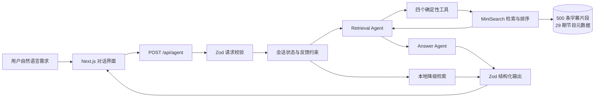
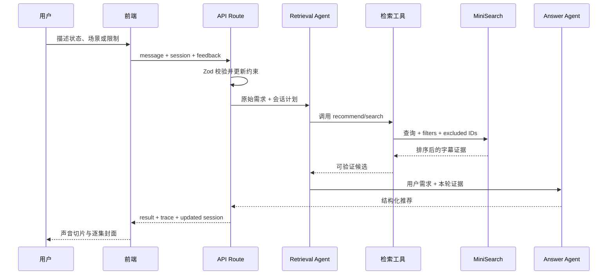

# Hey Tablo Agent 架构

## 系统全景



## 一次请求如何执行



## 四层职责

| 层 | 负责什么 | 不负责什么 |
|---|---|---|
| 产品界面 | 收集需求、展示推荐、接收反馈 | 不自行伪造推荐 |
| Agent 编排 | 规划、选工具、根据证据组织回答 | 不直接修改底层数据 |
| 确定性检索 | 搜索、排序、验证来源、排除历史结果 | 不生成开放式结论 |
| 数据与评测 | 节目元数据、字幕 Schema、证据字段、测试 | 不直接暴露内部备注给用户 |

## 关键设计决定

1. **模型负责规划，代码负责约束。** `excludeSegmentIds`、来源验证和数量限制在工具层执行，不能只依赖 Prompt。
2. **输出必须结构化。** 请求、会话与回答都经过 Zod，前端不解析自由文本。
3. **模型不可用仍可服务。** 缺少密钥或模型失败时，系统透明降级为本地 MiniSearch，并标记低置信度。
4. **用户文案和内部证据分层。** `recommendationCopy` 与个性化 `reason` 可以展示；`editorNote` 和 `evidenceSummary` 只用于审核与评测。
5. **多轮反馈可验证。** 每轮保留 `conversationId`，递增 `turn`，并把历史结果加入强制排除列表。

## 部署拓扑

```text
GitHub Repository
  └─ GitHub Actions：npm ci → typecheck → 12 tests → next build
       └─ 质量门禁通过
            └─ Vercel / 任意 Node.js 22 平台
                 ├─ Next.js 静态首页
                 ├─ Node.js API Route
                 └─ 服务端环境变量（Qwen 或 OpenAI）
```

密钥只配置在部署平台服务端，不使用 `NEXT_PUBLIC_` 前缀，也不提交 `.env.local`。
